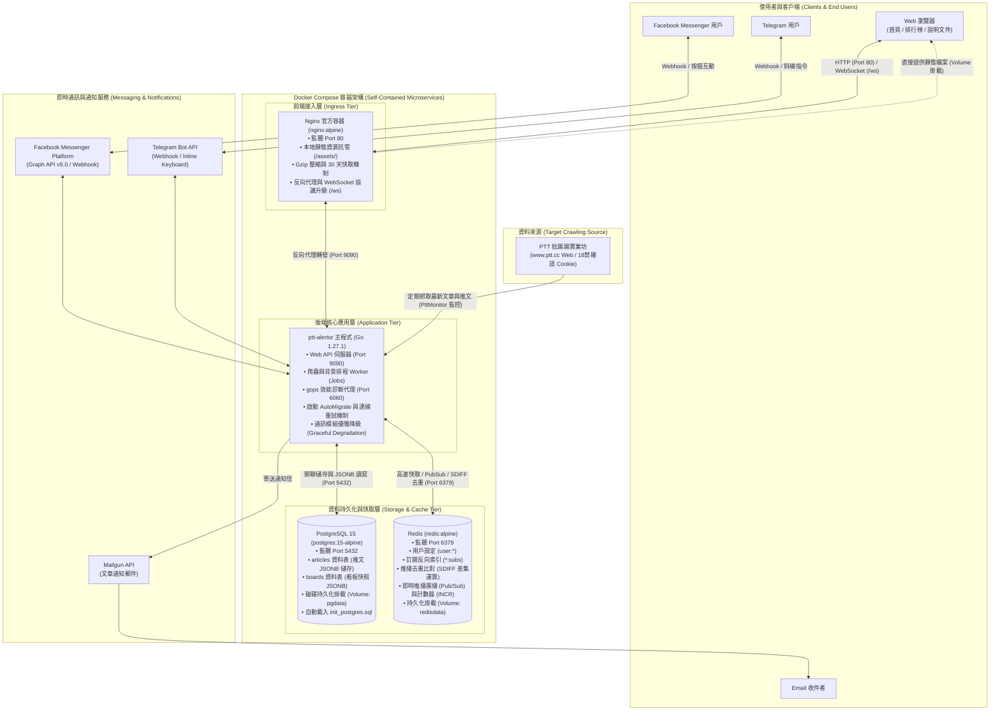

# Ptt-Alertor 服務架構與使用服務清單 (Services & Architecture)

本專案（Ptt-Alertor）是一個專為 PTT（批踢踢實業坊）設計的即時文章與推文通知系統。使用者可以透過各大即時通訊軟體（Facebook Messenger、Telegram、Email）訂閱指定看板的關鍵字、作者、推噓文門檻及特定文章的最新推文，並在第一時間接收即時推播通知。

本文件全面盤點專案進行架構現代化重構後的**所有使用服務、容器編排、資料庫儲存、快取中介、通知管道以及已淘汰之雲端服務對照**。

---

## 一、系統架構總覽 (Architecture Diagram)

本系統已全面過渡至**雲原生、開源自託管的 Docker Compose 微服務架構**，徹底解除對 AWS 專有服務（如 DynamoDB、S3、ECS）的綁定，僅需標準 Docker 環境即可一鍵部署運行：

---

## 二、使用服務與組件詳細清單 (Services & Components)

### 1. 容器編排與 Web 基礎設施 (Container Orchestration & Web Infrastructure)

| 服務名稱 | 核心角色 | 詳細說明與技術特性 | 相關設定或程式碼檔案 |
| :--- | :--- | :--- | :--- |
| **Docker & Docker Compose** | 宣告式容器編排與服務生命週期管理 | **全架構一鍵啟動核心**： 1. 宣告式管理 `app`、`postgres`、`redis`、`nginx` 四大微服務容器與掛載磁區（`pgdata`、`redisdata`）。 2. 內建 **Healthcheck（健康檢查）** 與 `depends_on: condition: service_healthy` 機制，確保資料庫與快取完全就緒後方才拉起主程式，避免啟動競爭。 3. 完全取代過往 AWS ECS / ECR 專屬部署流程，實現真正的跨雲與本機自託管。 | [`docker-compose.yml`](file:///docker-compose.yml) [`.dockerignore`](file:///dockerignore) |
| **Nginx** (`nginx:alpine`) | 反向代理、靜態伺服器與 WebSocket 閘道 | **徹底替代原有的 Amazon S3**，作為系統對外的單一 Web 流量入口： 1. **靜態資源高效託管**：透過 Volume 直接掛載 `./public` 至 `/usr/share/nginx/html`，直接提供圖檔（`alarmP.png`、`alarmP32x32.png`、`telegram_intro.gif`、`messenger_intro.gif`）、CSS、JS 與說明文件，開啟 Gzip 壓縮（級別 6）與 30 天瀏覽器快取。 2. **動態反向代理**：將 API 與動態頁面請求透明轉發至後端 Go 容器（`app:9090`），支援 Keep-Alive 連線。 3. **WebSocket 升級**：完整支援 `/ws` 協議 Upgrade/Connection 標頭轉發，支援首頁即時跳動計數器。 | [`nginx/conf.d/default.conf`](file:///nginx/conf.d/default.conf) [`docker-compose.yml`](file:///docker-compose.yml) |

---

### 2. 資料庫、快取與訊息中介 (Data Storage, Cache & Messaging)

| 服務名稱 | 核心角色 | 詳細說明與技術特性 | 相關設定或程式碼檔案 |
| :--- | :--- | :--- | :--- |
| **PostgreSQL 15** (`postgres:15-alpine`) | 開源關聯式資料庫 **(全面替代 AWS DynamoDB)** | 系統的核心持久化儲存庫，解決過往資料全置於 Redis 導致的記憶體成本高昂問題，並擺脫 DynamoDB 雲端鎖定： 1. **`articles` 資料表**：儲存文章完整結構（`code` 主鍵、`id`、`title`、`link`、`date`、`author`、`board`、`push_sum`、`last_push_date_time`），推文資料以原生 **`comments` JSONB** 儲存，並建立 `idx_articles_board` 與 `idx_articles_date` 索引。 2. **`boards` 資料表**：儲存各看板名稱及其抓取到的最新文章列表快照（**`articles` JSONB**）。 3. **連線池與自動遷移**：支援 `DATABASE_URL` 或個別參數配置，啟動時執行 `AutoMigrate` 確保 Schema 就緒，並提供標準 SQL 初始化檔。 | [`connections/postgres.go`](file:///connections/postgres.go) [`models/article/postgres.go`](file:///models/article/postgres.go) [`models/board/postgres.go`](file:///models/board/postgres.go) [`scripts/init_postgres.sql`](file:///scripts/init_postgres.sql) [`models/models.go`](file:///models/models.go) |
| **Redis** (`redis:alpine`) | 高速記憶體資料庫、快取與 Pub/Sub 代理 | 系統的即時運算與排程樞紐，具備五大核心關鍵任務： 1. **使用者設定與訂閱清單**：以 `user:{account}` 儲存用戶與通知條件。 2. **反向索引集合 (Inverted Index)**：`keyword:{board}:subs`、`author:{board}:subs`、`pushsum:{board}:subs`。 3. **推播去重差集計算 (De-duplication)**：利用 Redis 集合運算 (`SDIFF`, `SADD`) 比對 `pushsum:{account}:{board}:{kind}:base`、`bench`、`now`，精確推播尚未通知過的文章代碼，避免重複推播。 4. **全站排行榜 (Leaderboards)**：使用 Sorted Set (`ZADD`, `ZREVRANGE`) 計算最熱門的關鍵字、作者與推噓文門檻。 5. **即時推播計數與廣播**：透過 `INCR counter:alert` 累加通知總數，並使用 `PUBLISH alert-counter` 廣播給首頁 WebSocket 用戶。 6. **斷線重試機制**：連線池加入 5 次重試與間隔退避（Retry with Backoff），防止微服務啟動過程因暫時無法連線而崩潰。 | [`connections/redis.go`](file:///connections/redis.go) [`models/user/redis.go`](file:///models/user/redis.go) [`models/board/redis.go`](file:///models/board/redis.go) [`models/article/redis.go`](file:///models/article/redis.go) [`models/pushsum/pushsum.go`](file:///models/pushsum/pushsum.go) [`models/top/top.go`](file:///models/top/top.go) [`models/counter/counter.go`](file:///models/counter/counter.go) [`shorturl/shorturl.go`](file:///shorturl/shorturl.go) |

---

### 3. 即時通訊與通知管道服務 (Messaging & Notification Channels)

系統支援多元通道將符合條件的文章即時推播給用戶，並全面導入**優雅降級（Graceful Degradation）機制**：

| 服務名稱 | 角色定位 | 詳細用途與防禦性設計 | 相關設定或程式碼檔案 |
| :--- | :--- | :--- | :--- |
| **Facebook Messenger Platform** (Meta Graph API v9.0) | FB Messenger 聊天機器人 | 提供 Facebook 粉專的 Messenger 機器人互動： • Webhook 端點 `/messenger/webhook` 處理 Token 驗證（Hub Challenge）與使用者訊息。 • 支援按鈕樣板（Button Template）、清單樣板（List Template）、快捷回覆（Quick Replies）。 • 發送通知時附加 Message Tag (`CONFIRMED_EVENT_UPDATE`)。 | [`channels/messenger/messenger.go`](file:///channels/messenger/messenger.go) [`channels/messenger/webhook.go`](file:///channels/messenger/webhook.go) |
| **Telegram Bot API** (`telegram-bot-api`) | Telegram 聊天機器人 | 提供 Telegram 上的通知與指令機器人： • 支援自訂快捷小鍵盤（Reply Keyboard）、行內按鈕（Inline Keyboard）及斜線指令（`/start`, `/help`, `/list`, `/ranking`, `/add`, `/del`）。 • **Redis ZSET 延遲排程佇列**：推播訊息持久化入隊，非同步 Worker 瞬間釋放，重啟不掉訊息。 • **嚴格每秒 1 則限速**：基於聊天視窗（`chatID`）預排時間戳，嚴格限制每個聊天室每秒最多發送 1 則訊息。 • **429 智慧退避與重試**：自動解析 Telegram `retry after X`，設定該視窗冷卻並自動延遲重試，杜絕推播丟失。 • **優雅降級**：若 `TELEGRAM_TOKEN` 為空，啟動時僅輸出警告並自動關閉 Telegram 模組，不阻塞 Web 與排程服務。 | [`channels/telegram/telegram.go`](file:///channels/telegram/telegram.go) [`channels/telegram/queue.go`](file:///channels/telegram/queue.go) [`main.go`](file:///main.go) |
| **Mailgun API** (`mailgun-go.v1`) | 交易型 Email 寄送服務 | 提供電子郵件通知管道： • 當使用者填寫 Email 作為通知對象時，系統透過 Mailgun API 自動寄送整理好的看板新文章標題、關鍵字與連結。 | [`channels/mail/mail.go`](file:///channels/mail/mail.go) [`jobs/check.go`](file:///jobs/check.go) |

---

### 4. 執行環境、監控與代碼診斷 (Runtime, Monitoring & Profiling)

| 服務名稱 | 角色定位 | 詳細用途說明 | 相關設定或程式碼檔案 |
| :--- | :--- | :--- | :--- |
| **Go 執行環境** (升級至 Go 1.27.1) | 系統底層語言運行時 | • 全面自 Go 1.15 升級至 **Go 1.27.1**。 • 採用 `golang:1.27.1-alpine` 進行多階段容器編譯，執行映像檔精簡，內建時區資料庫（`tzdata`）與根憑證（`ca-certificates`）。 • 支援標準優雅停機（Graceful Shutdown，同時監聽 `SIGINT` 與 `SIGTERM`）。 | [`Dockerfile`](file:///Dockerfile) [`go.mod`](file:///go.mod) [`main.go`](file:///main.go) |
| **Google gops** (`github.com/google/gops`) | Go 程序診斷與效能分析代理 | 在 `:6060` 埠啟動 gops agent。維運人員可直接對容器進行即時診斷，包含檢查 Goroutine stack trace、Heap Memory 記憶體洩漏、CPU Profiling 等，無需中斷服務。 | [`main.go`](file:///main.go) [`docker-compose.yml`](file:///docker-compose.yml) |
| **Logrus** (`github.com/Ptt-Alertor/logrus`) | 結構化日誌輸出 | 統一輸出 JSON 或結構化日誌（Method、IP、URI、Runtime 錯誤等），日誌標準輸出交由 Docker Logs 驅動收集管理。 | 全專案各模組廣泛使用 |

---

### 5. 資料來源目標服務 (Target Data Source)

| 服務名稱 | 角色 | 用途與詳細說明 | 相關設定或程式碼檔案 |
| :--- | :--- | :--- | :--- |
| **PTT (批踢踢實業坊)** (`www.ptt.cc`) | 原始資料抓取來源 | • **Web 爬蟲**：自訂 HTTP Client 模擬瀏覽器 User-Agent 定期抓取各板（如 Gossiping、Stock 等）文章清單與內文推文，自動攜帶未滿十八歲確認 Cookie (`over18=1`)。 • **存活監控 (PttMonitor)**：定時檢測 `https://www.ptt.cc/bbs/index.html` 狀態碼；當 PTT 斷線時自動暫停爬蟲 Worker 避免徒勞請求，待 PTT 復原後自動喚醒爬蟲。 | [`ptt/web/crawler.go`](file:///ptt/web/crawler.go) [`ptt/http/http.go`](file:///ptt/http/http.go) [`jobs/pttmonitor.go`](file:///jobs/pttmonitor.go) |

---

## 三、重大架構演進與服務淘汰對照表 (Architecture Evolution & Deprecated Services)

本專案經過多次深度重構，逐步消除外部專有雲端依賴與第三方追蹤，以下為核心變更對照：

| 原始服務 / 架構 (Legacy) | 現行服務 / 架構 (Modern) | 變更類別 | 重構原因與優勢效益 (Rationale & Benefits) |
| :--- | :--- | :---: | :--- |
| **AWS DynamoDB** (`models/*/dynamodb.go`) | **PostgreSQL 15** (`models/*/postgres.go`) | 🗄️ 資料庫替換 | 1. **消除雲端鎖定**：完全開源，支援本機 Docker 與任何雲端資料庫。 2. **成本大幅降低**：磁碟持久化儲存，無需支付 AWS DynamoDB 讀寫單元 (RCU/WCU) 費用。 3. **原生 JSONB 支援**：推文與文章快照直接以 `JSONB` 存放，兼具 NoSQL 靈活性與關聯式強大查詢能力。 4. **自動化遷移**：內建 `AutoMigrate` 與 DDL 初始化腳本。 |
| **Amazon S3** (`https://{{.S3Domain}}/assets/`) | **Nginx 本地託管** (`/assets/` + Volume 掛載) | 🌐 靜態儲存 | 1. **資源自主掌控**：將 S3 上的靜態圖檔與檔案收納至專案 `public/assets/`。 2. **傳輸效能提升**：由 Nginx 原生處理靜態資源，內建 Gzip 壓縮與 30 天 HTTP 快取，減少外部網路跳轉。 3. **設定簡化**：徹底移除 `S3_DOMAIN` 環境變數與相關配置。 |
| **AWS ECS / ECR / SSM** (`task-definition.json`, `ecs-deploy`) | **Docker & Docker Compose** (`docker-compose.yml`) | 🚀 容器編排 | 1. **一鍵部署 (One-Click Start)**：僅需 `docker compose up -d` 即可拉起全套 4 大微服務。 2. **標準化環境變數**：以 `.env` 統一管理所有配置，取代 SSM Parameter Store。 3. **平台無關性**：支援在任何 Linux VPS、私有伺服器、本機環境快速落地。 |
| **自建 Nginx Dockerfile** | **官方 `nginx:alpine` 映像檔** (目錄 Volume 掛載) | 🐳 映像檔管理 | 直接採用官方輕量映像檔，透過掛載 `nginx/conf.d` 與 `public` 目錄提供服務，無需維護自建 Nginx 映像檔與構建時間。 |
| **啟動致命崩潰 (Fatal Panic)** | **優雅降級 (Graceful Degradation)** | 🛡️ 容錯與彈性 | 1. **通知金鑰選填**：未配置 Telegram Token 時自動關閉對應模組，不影響核心 API 與爬蟲運作。 2. **連線重試機制**：Redis 新增 5 次指數退避重試，解決容器平行拉起時的連線競態。 3. **平滑關機**：捕捉 `SIGTERM`/`SIGINT`，預留 5 秒讓進行中的 Worker 與連線安全結束。 |
| **Go 1.15** | **Go 1.27.1** | ⚙️ 語言執行時 | 升級編譯器至最新 Go 1.27.1，提升垃圾回收（GC）效能、模組依賴安全性與執行效率。 |
| **Google Analytics** (`google-analytics.js`) | **移除第三方分析腳本** | 🔒 隱私與簡化 | 移除外部追蹤腳本，減少第三方資料傳輸與前端 HTTP 請求阻塞，提升網頁加載速度與用戶隱私。 |
| **LINE 相關所有服務** (LINE Notify / Bot / Messaging API) | **全面移除 (Deprecated & Removed)** (Telegram & Messenger) | ❌ 服務移除 | **LINE 相關服務全面移除**：因應維護策略簡化及外部平台限制，系統已全面移除 LINE Bot、LINE Messaging API (`line-bot-sdk-go`)、Webhook 端點 `/line/callback`、前端頁面與圖檔，文章即時推播全面聚焦於 Telegram 與 Facebook Messenger。 |

---

## 四、各服務使用場景與資料流總結 (Summary of Workflows)

1. **使用者訂閱情境**：
   - 用戶在 Messenger / Telegram 發送指令「新增 八卦板 關鍵字 問卦」。
   - 各通訊平台的 Webhook 透過 Nginx 反向代理進入 Go API 伺服器，交給 `command` 模組處理。
   - 資料寫入 **Redis**：更新 `user:{account}` 訂閱清單，並在 `keyword:Gossiping:subs` 集合中加入該用戶帳號。

2. **定時爬取與比對推播情境**：
   - `Checker` / `PushSumChecker` 背景 Worker 定期爬取 **PTT** 看板新文章。
   - 比對 **Redis** 快取的上一批文章快照，識別出最新發布或達標文章。
   - 若有新文章符合條件，將完整文章結構保存至 **PostgreSQL**（`articles` 與 `boards` 表，包含推文 JSONB）。
   - 透過 **Redis SDIFF** 比對確保推播去重後，將發送任務放入 channel，由非同步 Worker 透過 **Messenger API**、**Telegram Bot API** 或 **Mailgun** 發送通知給訂閱者。
   - 每發出一則通知，即時執行 `INCR counter:alert` 並透過 **Redis PUBLISH** 廣播更新，讓官網的 WebSocket 訪客即時看見全站累積通知數跳動。
